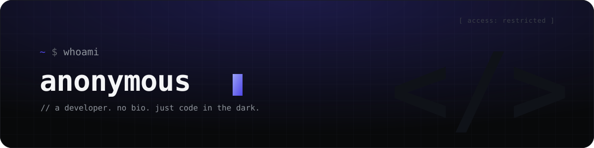

 

 

> _Some build in public. I build in the dark._
> _No projects listed. No story to tell. Only commits._

 

  

<picture>
  <source media="(prefers-color-scheme: dark)" srcset="https://raw.githubusercontent.com/SiroProg/SiroProg/output/snake-dark.svg" />
  
</picture>

  

<code>// no data. only code.</code>

